# Diagramma ER – Database ETSOK

Diagramma Entity-Relationship del database, generato dalle migrazioni Laravel.

```mermaid
erDiagram
    users ||--o{ members : "user_id"
    users ||--o{ role_user : ""
    users ||--o{ member_invites : "invited_by"
    users ||--o{ sessions : "user_id"

    roles ||--o{ role_user : ""
    role_user }o--|| users : ""
    role_user }o--|| roles : ""

    member_types ||--o{ members : "member_type_id"
    members }o--|| member_types : ""
    members ||--o{ subscriptions : "member_id"
    members ||--o{ incassi : "member_id"
    members ||--o{ receipts : "member_id"
    members ||--o{ expense_refunds : "member_id"
    members ||--o{ event_registrations : "member_id"
    members ||--o{ incarichi : "member_id"
    members ||--o{ candidature : "member_id"
    members ||--o{ partecipazioni_voto : "member_id"
    members ||--o{ sostituito_da : "sostituito_da_member_id"

    subscriptions }o--o| members : ""
    incassi }o--o| members : ""
    incassi }o--o| subscriptions : "subscription_id"
    incassi }o--|| conti : "conto_id"

    conti ||--o{ prima_nota_entries : "conto_id"
    conti ||--o{ incassi : ""
    conti ||--o{ spese : "conto_id"

    ledger_accounts ||--o{ ledger_accounts : "parent_id"
    ledger_accounts ||--o| ledger_account_rendiconto : ""
    rendiconto_voci ||--o{ ledger_account_rendiconto : "rendiconto_voce_id"
    ledger_account_rendiconto }o--|| ledger_accounts : "ledger_account_id"
    ledger_account_rendiconto }o--|| rendiconto_voci : ""

    prima_nota_entries }o--|| conti : ""
    prima_nota_entries }o--o| incassi : "entryable"
    prima_nota_entries }o--o| expense_refunds : "entryable"
    prima_nota_entries }o--o| spese : "entryable"
    spese }o--|| conti : "conto_id"

    receipts }o--o| members : ""
    receipts ||--o| expense_refunds : "receivable"
    receipts ||--o| incassi : "receivable"
    expense_refunds }o--o| receipts : "receipt_id"
    expense_refunds ||--o{ refund_items : "expense_refund_id"
    refund_items }o--|| expense_refunds : ""

    organi ||--o{ cariche_sociali : "organo_id"
    organi ||--o{ elezioni : "organo_id"
    cariche_sociali ||--o{ incarichi : "carica_sociale_id"
    incarichi }o--|| members : ""
    incarichi }o--|| cariche_sociali : ""
    elezioni }o--o| organi : ""
    elezioni ||--o{ candidature : "elezione_id"
    elezioni ||--o{ partecipazioni_voto : "elezione_id"
    elezioni ||--o{ voti : "elezione_id"
    candidature }o--|| elezioni : ""
    candidature }o--|| members : ""
    partecipazioni_voto }o--|| members : ""
    partecipazioni_voto }o--|| elezioni : ""
    voti }o--|| elezioni : ""
    voti }o--|| candidature : "candidatura_id"

    events ||--o{ event_registrations : "event_id"
    event_registrations }o--|| events : ""
    event_registrations }o--|| members : ""

    locations ||--o{ warehouses : "location_id"
    properties ||--o{ assets : "property_id"
    warehouses ||--o{ warehouse_stock : "warehouse_id"
    items ||--o{ warehouse_stock : "item_id"
    warehouse_stock }o--|| warehouses : ""
    warehouse_stock }o--|| items : ""

    users {
        bigint id PK
        string name
        string email UK
        string password
        timestamp email_verified_at
        timestamp remember_token
        bigint current_team_id
        string profile_photo_path
        string timestamps
    }

    roles {
        bigint id PK
        string name UK
        string display_name
        string timestamps
    }

    role_user {
        bigint role_id PK,FK
        bigint user_id PK,FK
        string timestamps
    }

    member_types {
        bigint id PK
        string name UK
        string display_name
        string timestamps
    }

    members {
        bigint id PK
        bigint user_id FK "nullable"
        bigint sostituito_da_member_id FK "nullable"
        bigint member_type_id FK
        string numero_tessera
        string nome
        string cognome
        string email
        string codice_fiscale
        date data_nascita
        date data_iscrizione
        string stato
        string indirizzo
        string telefono
        text note
        date domanda_presentata_at
        date ammissione_decisa_at
        string ammissione_esito
        string rigetto_motivo
        date rigetto_comunicato_at
        date ricorso_presentato_at
        date assemblea_esame_data
        date data_cessazione
        string cessazione_causa
        date dimissioni_presentate_at
        string motivo_esclusione
        date deceduto_at
        string timestamps
    }

    member_invites {
        bigint id PK
        string email
        string token UK
        datetime expires_at
        datetime used_at
        bigint invited_by FK "nullable"
        string timestamps
    }

    subscriptions {
        bigint id PK
        bigint member_id FK
        smallint year
        date started_at
        date ends_at
        string status
        string timestamps
    }

    conti {
        bigint id PK
        string name
        string code
        string type
        string iban "nullable"
        int ordine
        boolean attivo
        string timestamps
    }

    ledger_accounts {
        bigint id PK
        bigint parent_id FK "nullable"
        string code UK
        string name
        string type
        string gestione "nullable"
        boolean competenza_cassa
        string timestamps
    }

    rendiconto_voci {
        bigint id PK
        string sezione
        string codice_voce
        string descrizione
        string tipo
        smallint ordine
        string timestamps
    }

    ledger_account_rendiconto {
        bigint id PK
        bigint ledger_account_id FK,UK
        bigint rendiconto_voce_id FK
        string timestamps
    }

    prima_nota_entries {
        bigint id PK
        bigint conto_id FK
        string entryable_type "nullable"
        bigint entryable_id "nullable"
        date date
        decimal amount
        string description "nullable"
        string gestione "nullable"
        boolean competenza_cassa
        string rendiconto_code "nullable"
        string timestamps
    }

    incassi {
        bigint id PK
        bigint member_id FK "nullable"
        bigint subscription_id FK "nullable"
        decimal amount
        datetime paid_at
        bigint conto_id FK "nullable"
        string description "nullable"
        timestamp receipt_issued_at "nullable"
        string type
        boolean genera_prima_nota
        string donor_name "nullable"
        string timestamps
    }

    receipts {
        bigint id PK
        bigint member_id FK "nullable"
        string recipient_name "nullable"
        string receivable_type
        bigint receivable_id
        string number UK
        date issued_at
        string file_path "nullable"
        string type
        string timestamps
    }

    expense_refunds {
        bigint id PK
        bigint member_id FK
        date refund_date
        string status
        decimal total
        bigint receipt_id FK "nullable"
        string timestamps
    }

    spese {
        bigint id PK
        date date
        decimal amount
        string description "nullable"
        bigint conto_id FK
        boolean genera_prima_nota
        string rendiconto_code "nullable"
        string gestione "nullable"
        boolean competenza_cassa
        string timestamps
    }

    refund_items {
        bigint id PK
        bigint expense_refund_id FK
        string description "nullable"
        decimal amount
        string timestamps
    }

    enti {
        bigint id PK
        string nome
        text note "nullable"
        string timestamps
    }

    organi {
        bigint id PK
        string slug UK "nullable"
        string nome
        smallint durata_mesi "nullable"
        boolean richiedi_elezioni_fine_mandato
        date mandato_da "nullable"
        string timestamps
    }

    cariche_sociali {
        bigint id PK
        bigint organo_id FK
        string nome
        smallint ordine
        boolean multiplo
        string timestamps
    }

    incarichi {
        bigint id PK
        bigint member_id FK
        bigint carica_sociale_id FK
        string timestamps
    }

    elezioni {
        bigint id PK
        bigint organo_id FK "nullable"
        string titolo
        date data_elezione
        string stato
        boolean permetti_astenuti
        timestamp invalidata_at "nullable"
        text motivazione_invalidazione "nullable"
        string timestamps
    }

    candidature {
        bigint id PK
        bigint elezione_id FK
        bigint member_id FK
        string timestamps
    }

    partecipazioni_voto {
        bigint id PK
        bigint member_id FK
        bigint elezione_id FK
        string timestamps
    }

    voti {
        bigint id PK
        bigint elezione_id FK
        bigint candidatura_id FK
        string timestamps
    }

    events {
        bigint id PK
        string title
        datetime start_at
        datetime end_at "nullable"
        int max_participants "nullable"
        text description "nullable"
        boolean solo_soci "nullable"
        string timestamps
    }

    event_registrations {
        bigint id PK
        bigint event_id FK
        bigint member_id FK
        timestamp registered_at
        string status
        string guest "nullable"
        string timestamps
    }

    documents {
        bigint id PK
        string titolo "nullable"
        date data "nullable"
        longtext contenuto "nullable"
        string timestamps
    }

    verbali {
        bigint id PK
        string tipo
        date data
        smallint anno
        string titolo
        text contenuto "nullable"
        tinyint numero "nullable"
        string stato
        string timestamps
    }

    templates {
        bigint id PK
        string nome
        string categoria
        string tipo_verbale "nullable"
        longtext contenuto "nullable"
        string timestamps
    }

    attachments {
        bigint id PK
        string attachable_type
        bigint attachable_id "nullable"
        string tag "nullable"
        string file_path
        string original_name
        string mime_type "nullable"
        bigint size "nullable"
        string disk
        string timestamps
    }

    locations {
        bigint id PK
        string name
        string address "nullable"
        string tipo "nullable"
        string timestamps
    }

    properties {
        bigint id PK
        string name
        string address "nullable"
        text notes "nullable"
        string timestamps
    }

    assets {
        bigint id PK
        bigint property_id FK "nullable"
        string name
        string code "nullable"
        date purchase_date "nullable"
        decimal value "nullable"
        text notes "nullable"
        string timestamps
    }

    maintenance_records {
        bigint id PK
        string maintainable_type
        bigint maintainable_id
        date date
        string description "nullable"
        decimal cost "nullable"
        string timestamps
    }

    warehouses {
        bigint id PK
        bigint location_id FK "nullable"
        string name
        string timestamps
    }

    items {
        bigint id PK
        string name
        string code UK "nullable"
        string unit
        string timestamps
    }

    warehouse_stock {
        bigint id PK
        bigint warehouse_id FK
        bigint item_id FK
        decimal quantity
        string timestamps
    }

    suppliers {
        bigint id PK
        string name
        string email "nullable"
        string phone "nullable"
        string timestamps
    }

    email_templates {
        bigint id PK
        string tipo UK
        string subject
        longtext body_html "nullable"
        string timestamps
    }

    settings {
        string key PK
        text value "nullable"
    }

    password_reset_tokens {
        string email PK
        string token
        timestamp created_at
    }

    sessions {
        string id PK
        bigint user_id FK "nullable"
        string ip_address
        text user_agent
        longtext payload
        int last_activity
    }
```

## Note

- **Relazioni polimorfiche**: `prima_nota_entries.entryable_type` / `entryable_id` puntano a `Incasso`, `ExpenseRefund` o `Spesa`; `receipts.receivable_type` / `receivable_id` puntano a `Incasso` o `ExpenseRefund`; `attachments.attachable_type` / `attachable_id` per allegati generici; `maintenance_records.maintainable_type` / `maintainable_id` per manutenzioni su Asset/Property.
- **Organi / Enti**: la FK `organi.ente_id` è stata rimossa in una migrazione; la tabella `enti` esiste ma non è collegata a `organi` nello schema attuale.
- **Subscriptions**: la tabella non ha più `membership_type_id`; è presente `year` con unique su `(member_id, year)`.
- **Documents**: convertiti in “letterhead” (carta intestata): solo `titolo`, `data`, `contenuto`; rimosso `member_id`.
